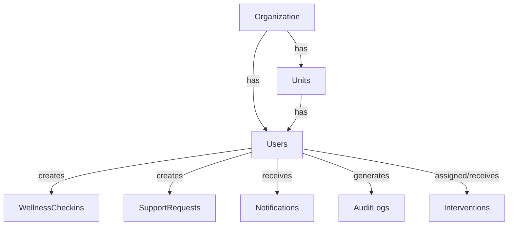

# ManRakshak Backend V1

FastAPI, PostgreSQL, SQLAlchemy backend for the ManRakshak organizational wellness platform.

## 1. Project Overview
This backend provides secure APIs, role-based access control, and data persistence for both the Flutter Personnel Mobile App and the React Organization Web Dashboard.

## 2. Technology Stack

| Technology | Purpose | Why we use it |
|---|---|---|
| **Python** | Backend language | Excellent ecosystem for AI/ML and backend development |
| **FastAPI** | REST API framework | Fast, modern, type-safe and naturally suited to Python AI systems |
| **Pydantic** | Data validation | Strong request/response validation |
| **SQLAlchemy** | ORM/database layer | Structured interaction with PostgreSQL |
| **PostgreSQL** | Primary database | Reliable relational database for structured and sensitive application data |
| **Alembic** | Database migrations | Version-controlled database schema changes |
| **JWT** | Authentication | Stateless API authentication |
| **Argon2/bcrypt** | Password hashing | Prevents storing plaintext passwords |
| **pytest** | Testing | Automated backend/API testing |
| **httpx** | API testing | Testing FastAPI endpoints |

## 3. Requirements
- Python 3.12+
- PostgreSQL 15+ (Local or Docker)

## 3. PostgreSQL Setup
If you have Docker installed, you can start the database using:
```bash
docker-compose up -d
```
Otherwise, ensure PostgreSQL is running locally on port 5432 with the credentials specified in the `.env` file.

## 4. Environment Setup
Copy the environment example:
```bash
cp .env.example .env
```

## 5. Install Dependencies
```bash
python -m venv venv
# On Windows
.\venv\Scripts\Activate.ps1
# On Mac/Linux
source venv/bin/activate

pip install -r requirements.txt
```

## 6. Database Architecture

The application uses PostgreSQL with SQLAlchemy 2 as the ORM. Models use modern `Mapped` types and timezone-aware timestamps.

### ER Relationship Overview



### Simple Relationship Diagram

Organization
    ↓
Units
    ↓
Users
    ├── Wellness Check-ins
    ├── Support Requests
    ├── Notifications
    └── Interventions

Users
    ↓
Audit Logs

### Tables, Fields, Enums
- **organizations**: `id` (UUID), `organization_code`, `name`, `wellness_checkin_frequency` (CheckinFrequency), `created_at`, `updated_at`.
- **units**: `id` (UUID), `organization_id`, `unit_code`, `unit_name`, `status` (UnitStatus), `created_at`, `updated_at`.
- **users**: `id` (UUID), `organization_id`, `unit_id`, `user_code`, `name`, `email`, `mobile_number`, `address`, `team`, `password_hash`, `role` (UserRole), `status` (UserStatus), `created_at`, `updated_at`, `last_login_at`.
- **wellness_checkins**: `id` (UUID), `personnel_id`, `checkin_date`, `sleep_hours`, `sleep_quality`, `mood_score`, `energy_score`, `workload_score`, `stress_score`, `created_at`.
- **support_requests**: `id` (UUID), `personnel_id`, `request_type` (SupportRequestType), `message`, `status` (SupportRequestStatus), `created_at`, `updated_at`.
- **interventions**: `id` (UUID), `personnel_id`, `assigned_officer_id`, `action_type` (InterventionActionType), `notes`, `follow_up_date`, `status` (InterventionStatus), `created_at`, `updated_at`.
- **notifications**: `id` (UUID), `user_id`, `notification_type` (NotificationType), `title`, `message`, `is_read`, `related_resource`, `created_at`.
- **audit_logs**: `id` (UUID), `user_id`, `action` (AuditAction), `resource_type`, `resource_id`, `timestamp`, `ip_address`.

Enums defined: `UserRole`, `UserStatus`, `UnitStatus`, `CheckinFrequency`, `SupportRequestType`, `SupportRequestStatus`, `InterventionActionType`, `InterventionStatus`, `NotificationType`, `AuditAction`.

## 7. Migration Commands
Generate the database schema using Alembic:
```bash
alembic revision --autogenerate -m "Schema update"
alembic upgrade head
```

## 8. Run Tests
Run the complete automated test suite:
```bash
pytest -v
```

## 9. API Endpoints Overview

### Personnel APIs
- `GET /api/v1/personnel/me`: Retrieve authenticated user's profile.
- `GET /api/v1/personnel`: Paginated personnel list with filtering (Welfare Officer, Commander, Admin within org scope).
- `GET /api/v1/personnel/{id}`: Detailed personnel record (authorized Welfare Officer, Admin, or self).

### Wellness Check-in APIs
- `POST /api/v1/wellness/checkins`: Record daily check-in (derives identity from JWT; validates frequency policy).
- `GET /api/v1/wellness/me`: Paginated personal check-in history with date filters.
- `GET /api/v1/wellness/{personnel_id}`: Individual wellness history (Welfare Officer only; Commander/Admin strictly forbidden).

### Support Request APIs
- `POST /api/v1/support/requests`: Submit welfare support request (Personnel only; auto-notifies Welfare Officers).
- `GET /api/v1/support/requests`: Welfare Officer queue / Personnel self-list (summary fields, no private messages in list).
- `GET /api/v1/support/requests/{id}`: Private support details (authorized Welfare Officer or self).
- `PATCH /api/v1/support/requests/{id}`: State transitions: `OPEN -> IN_REVIEW -> RESOLVED -> CLOSED`.

### Intervention & Follow-up APIs
- `POST /api/v1/interventions`: Create intervention (Welfare Officer only).
- `GET /api/v1/interventions`: List interventions (paginated, officer notes hidden from personnel).
- `GET /api/v1/interventions/{id}`: Intervention detail (notes protected from non-welfare roles).
- `PATCH /api/v1/interventions/{id}`: Update intervention (preserves immutable `personnel_id`).
- `POST /api/v1/interventions/{id}/complete`: Mark completed and send status notification.
- `POST /api/v1/interventions/{id}/reschedule`: Update follow-up date and notify parties.

### Notification APIs
- `GET /api/v1/notifications`: Paginated user notifications with `is_read` and `notification_type` filters.
- `GET /api/v1/notifications/unread-count`: Count of unread notifications for current authenticated user.
- `GET /api/v1/notifications/{id}`: Single notification detail (owner only, 404 on ID enumeration attempts).
- `PATCH /api/v1/notifications/{id}/read`: Idempotent single mark-read.
- `PATCH /api/v1/notifications/read-all`: Bulk mark all unread notifications as read.

### Analytics APIs (SQL Aggregation & Minimum Cohort Firewall)
- `GET /api/v1/analytics/wellness`: Organization/unit aggregate wellness averages and daily trend points.
- `GET /api/v1/analytics/workload`: Organization/unit aggregate workload averages and daily trend points.
- `GET /api/v1/analytics/units`: Unit-level aggregate comparisons (cohort threshold evaluated per unit).

### Reports & Controlled Export APIs
- `GET /api/v1/reports/wellness`: Aggregate wellness report with metadata, versioning, summary, and trend.
- `GET /api/v1/reports/wellness/export`: Export aggregate wellness report (CSV or JSON).
- `GET /api/v1/reports/workload`: Aggregate workload report.
- `GET /api/v1/reports/workload/export`: Export aggregate workload report (CSV or JSON).
- `GET /api/v1/reports/units`: Unit-level aggregate comparison report.
- `GET /api/v1/reports/units/export`: Export unit-level aggregate report (CSV or JSON).
- `GET /api/v1/reports/welfare-activity`: Aggregate welfare operations summary (support request & intervention metrics).
- `GET /api/v1/reports/welfare-activity/export`: Export welfare operational metrics (CSV or JSON).

## 10. Start FastAPI Server
```bash
uvicorn app.main:app --reload
```
The server will start at `http://localhost:8000`.

## 11. API Documentation
FastAPI automatically generates interactive documentation:
- Swagger UI: `http://localhost:8000/docs`
- ReDoc: `http://localhost:8000/redoc`

## 12. Security & Privacy Firewall Rules
- **Malicious Payload Defense**: Input schemas enforce `extra = "forbid"` to strictly reject unexpected or spoofed fields (like client-supplied `personnel_id`) with HTTP 422.
- **Commander Privacy Boundary**: Commanders and Administrators are strictly forbidden (HTTP 403) from accessing individual wellness check-ins, private support messages, and intervention notes.
- **Minimum Cohort Size Rule (`ANALYTICS_MIN_COHORT_SIZE = 5`)**: When fewer than 5 distinct personnel contribute data in a requested scope/date range, aggregate metrics are omitted and an `insufficient_cohort: true` privacy response is returned.
- **Zero Sensitive Leaks in Logs, Notifications & Exports**: Audit logs, notification texts, and CSV/JSON exports never leak private support messages, intervention notes, or raw individual scores.
- **Organization & Unit Scoping**: Every query is isolated by `organization_id` and verified against authorized units.


