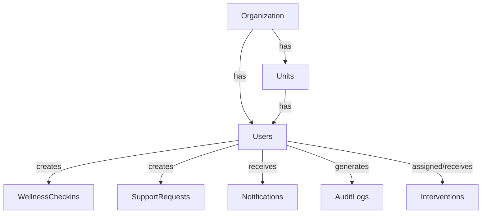

# ManRakshak Backend V1

FastAPI, PostgreSQL, SQLAlchemy backend for the ManRakshak organizational wellness platform.

## 1. Project Overview
This backend provides secure APIs, role-based access control, and data persistence for both the Flutter Personnel Mobile App and the React Organization Web Dashboard.

## 2. Technology Stack

| Technology | Purpose | Why we use it |
|---|---|---|
| **Python** | Backend language | Excellent ecosystem for AI/ML and backend development |
| **FastAPI** | REST API framework | Fast, modern, type-safe and naturally suited to Python AI systems |
| **Pydantic** | Data validation | Strong request/response validation |
| **SQLAlchemy** | ORM/database layer | Structured interaction with PostgreSQL |
| **PostgreSQL** | Primary database | Reliable relational database for structured and sensitive application data |
| **Alembic** | Database migrations | Version-controlled database schema changes |
| **JWT** | Authentication | Stateless API authentication |
| **Argon2/bcrypt** | Password hashing | Prevents storing plaintext passwords |
| **pytest** | Testing | Automated backend/API testing |
| **httpx** | API testing | Testing FastAPI endpoints |

## 3. Requirements
- Python 3.12+
- PostgreSQL 15+ (Local or Docker)

## 3. PostgreSQL Setup
If you have Docker installed, you can start the database using:
```bash
docker-compose up -d
```
Otherwise, ensure PostgreSQL is running locally on port 5432 with the credentials specified in the `.env` file.

## 4. Environment Setup
Copy the environment example:
```bash
cp .env.example .env
```

## 5. Install Dependencies
```bash
python -m venv venv
# On Windows
.\venv\Scripts\Activate.ps1
# On Mac/Linux
source venv/bin/activate

pip install -r requirements.txt
```

## 6. Database Architecture

The application uses PostgreSQL with SQLAlchemy 2 as the ORM. Models use modern `Mapped` types and timezone-aware timestamps.

### ER Relationship Overview



### Simple Relationship Diagram

Organization
    ↓
Units
    ↓
Users
    ├── Wellness Check-ins
    ├── Support Requests
    ├── Notifications
    └── Interventions

Users
    ↓
Audit Logs

### Tables, Fields, Enums
- **organizations**: `id` (UUID), `organization_code`, `name`, `created_at`, `updated_at`.
- **units**: `id` (UUID), `organization_id`, `unit_code`, `unit_name`, `status` (UnitStatus), `created_at`, `updated_at`.
- **users**: `id` (UUID), `organization_id`, `unit_id`, `user_code`, `name`, `email`, `password_hash`, `role` (UserRole), `status` (UserStatus), `created_at`, `updated_at`, `last_login_at`.
- **wellness_checkins**: `id` (UUID), `personnel_id`, `checkin_date`, `sleep_hours`, `sleep_quality`, `mood_score`, `energy_score`, `workload_score`, `stress_score`, `created_at`.
- **support_requests**: `id` (UUID), `personnel_id`, `request_type` (SupportRequestType), `message`, `status` (SupportRequestStatus), `created_at`, `updated_at`.
- **interventions**: `id` (UUID), `personnel_id`, `assigned_officer_id`, `action_type` (InterventionActionType), `notes`, `follow_up_date`, `status` (InterventionStatus), `created_at`, `updated_at`.
- **notifications**: `id` (UUID), `user_id`, `notification_type` (NotificationType), `title`, `message`, `is_read`, `related_resource`, `created_at`.
- **audit_logs**: `id` (UUID), `user_id`, `action` (AuditAction), `resource_type`, `resource_id`, `timestamp`, `ip_address`.

Enums defined: `UserRole`, `UserStatus`, `UnitStatus`, `SupportRequestType`, `SupportRequestStatus`, `InterventionActionType`, `InterventionStatus`, `NotificationType`, `AuditAction`.

## 7. Migration Commands
Generate the initial database schema using Alembic:
```bash
alembic revision --autogenerate -m "Initial database schema"
alembic upgrade head
```

To downgrade the schema entirely (Database Reset Procedure):
```bash
alembic downgrade base
alembic upgrade head
```

## 8. Seed Database
Generate mock personnel, units, check-ins, and demo accounts:
```bash
python -m app.db.seed
```
To reset the development database before seeding again:
```bash
python -m app.db.seed --reset
```

## 9. Run Tests
Run the test suite:
```bash
pytest
```

## 8. Start FastAPI
```bash
uvicorn app.main:app --reload
```
The server will start at `http://localhost:8000`.

## 9. API Documentation
FastAPI automatically generates documentation:
- Swagger UI: `http://localhost:8000/docs`
- ReDoc: `http://localhost:8000/redoc`

## 10. Demo Credentials
All demo accounts use the password: `demo123`

- Personnel: `p001@demo.com`
- Welfare Officer: `welfare@demo.com`
- Commander: `commander@demo.com`
- Administrator: `admin@demo.com`

## 11. Security Notes
- Passwords are hashed using bcrypt.
- JWT tokens are issued with a 24-hour expiration.
- All endpoints are protected by Role-Based Access Control (RBAC).
- Commander roles are strictly prohibited from viewing individual wellness records.
- Audit logs track access events without storing sensitive PHI data.
